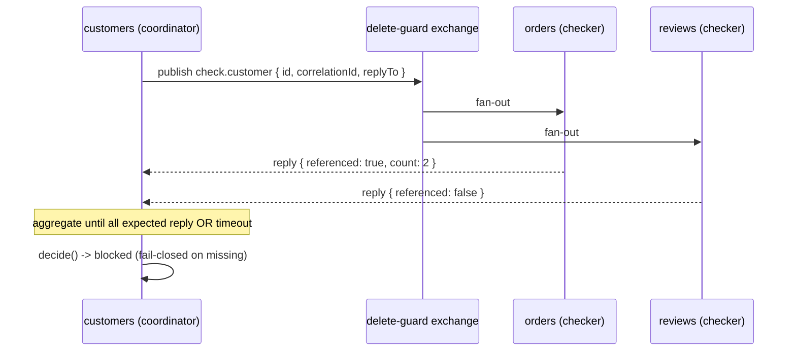

# delete-guard

[](https://github.com/TANISHA3665/delete-guard/actions/workflows/ci.yml)
[](./LICENSE)

Distributed referential-integrity checks for deletes — over RabbitMQ.

Before a service deletes an entity, `delete-guard` asks the other services
whether any of them still reference it, aggregates the answers, and returns an
allow/block decision with reasons. **Fail-closed by default.**

## Why

In a modular/microservice backend, deleting a `customer` in one service can
orphan `orders` and `reviews` owned by others. `delete-guard` makes the
delete ask first.

## Install

```bash
npm install delete-guard
```

## Usage

```ts
import { DeleteGuard } from 'delete-guard';

// Checker service (orders)
const orders = await DeleteGuard.connect({ url, serviceName: 'orders' });
await orders.registerChecker('customer', async (id) => {
  const open = await db.orders.count({ customerId: id, status: 'open' });
  return open > 0
    ? { referenced: true, count: open, detail: `${open} open orders` }
    : { referenced: false };
});

// Coordinator service (customers)
const customers = await DeleteGuard.connect({ url, serviceName: 'customers' });
const verdict = await customers.check({
  resource: 'customer',
  id: '123',
  expect: ['orders', 'reviews'],
  timeoutMs: 2000,
  onTimeout: 'block', // fail-closed default
});
// { allowed: false, blockers: [{ service: 'orders', count: 2, detail: '2 open orders' }], missing: [] }
```

## How it works



- Topic exchange `delete-guard`, routing key `check.<resource>`.
- Coordinator waits for every service in `expect` to reply, or until `timeoutMs`.
- Missing/errored checkers -> blocked by default (`onTimeout: 'block'`).

## Run the demo

```bash
docker compose -f examples/demo/docker-compose.yml up --build
curl -X DELETE localhost:3000/customers/c1   # 409 — 2 open orders, 1 reviews
curl -X DELETE localhost:3001/orders/c1
curl -X DELETE localhost:3002/reviews/c1
curl -X DELETE localhost:3000/customers/c1   # { "deleted": true }
```

## Test

```bash
npm test            # unit + integration (integration needs Docker)
npm run test:unit   # unit only
```

## Limitations

- Broker auto-reconnect with backoff is not yet implemented: a `check()` issued
  while the connection is down will reject rather than resolving fail-closed.
  Tracked as a follow-up.

## License

MIT
